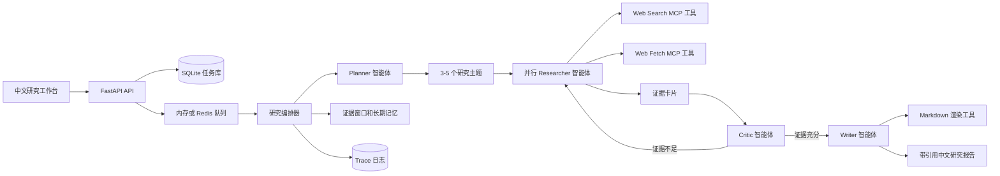

# 迭代式深度研究智能体平台

这是一个面向开放式问题的多智能体深度研究练习项目。项目目标不是包装成成熟商业产品，而是把 Agent 开发中的规划、工具调用、RAG、记忆、状态管理、模型路由、证据追踪和可观测性串成一条完整链路。系统会把用户问题拆解为多个研究主题，并行执行网页检索与页面抓取，将来源转化为段落级证据卡片，再由 Critic 判断证据覆盖是否充分，最后生成带引用追溯的 Markdown 中文研究报告。

项目默认可以在没有付费搜索 API 的情况下运行：搜索侧支持自托管 `SearXNG`，并用 `Playwright`、`DuckDuckGo` 作为后备；抓取侧优先使用 `Crawl4AI` 做正文抽取和 Markdown 清洗；模型侧保留路由、延迟、token、成本、重试和 trace 统计链路。

## 架构



## 智能体流程

1. **Planner** 将开放问题拆解为 3-5 个可检索子主题，并生成任务图。
2. **Researcher** 针对每个主题并行调用搜索和抓取工具，抽取带 URL 和段落 ID 的 `EvidenceCard`。
3. **Critic** 评估覆盖度、忠实度和答案相关性；证据不足时生成 follow-up 主题追加检索。
4. **Writer** 基于已批准证据卡片生成中文 Markdown 报告，并附引用索引。

## 功能

- 基于 LangGraph `StateGraph` 实现 `Planner -> Researcher -> Critic -> Writer` 协作闭环
- 使用 LangGraph 条件边表达 `Critic 通过 -> Writer`、`证据不足 -> 下一轮 Researcher`
- 可配置的多轮 deep research：`max_research_rounds`
- 支持 Tavily 真实搜索
- 支持 `SearXNG -> Playwright -> DuckDuckGo` 的本地/自托管搜索链路
- 正文抓取优先使用 `Crawl4AI`，失败时退回轻量 `httpx + HTML` 解析
- MCP 风格工具 Schema：Web Search、Web Fetch、Python 沙盒、文档读取、Markdown 渲染
- 每张证据卡包含 URL、标题、段落 ID、snippet、置信度和来源类型
- 滑动证据窗口和长期任务记忆
- 证据接口：`GET /task/{task_id}/evidence`
- 产物导出接口：`POST /task/{task_id}/artifacts`，生成 `report.md`、`evidence_cards.json`、`citations.json`、`trace.json`、`metrics.json`、`run_manifest.json`
- 搜索健康检查接口：`GET /search/providers`
- 离线评测脚本：`evals/run_evals.py`，输出覆盖度、来源数、引用数、关键词召回、Critic 分数和成本估算
- 中文研究工作台：证据卡片墙、Critic 评分、选中文本生成卡片、JSON/Markdown 导出
- 多模型路由：
  - planner：`gpt-5`
  - researcher：`gpt-5-nano`
  - critic：可选 `Qwen2.5-72B-Instruct-INT4` via vLLM
  - writer：`gpt-5-mini`
- Provider fallback、黑名单、重试、超时、token、成本和延迟统计
- SQLite 持久化任务、步骤、日志、任务图、工具调用和指标
- 每个 LangGraph 节点完成后写入 `langgraph_node_completed` trace 事件
- 默认内存队列，可切换 Redis
- FastAPI 接口和轻量中文前端

## 工程设计文档

完整 GitBook 风格设计手册见 [`docs/gitbook/README.md`](docs/gitbook/README.md)，覆盖 Agent 开发设计、多 Agent 编排、工具调用、RAG 系统、记忆与上下文血统、状态管理、模型路由、证据追踪、可观测性和 GitHub 展示建议。

## 目录结构

```text
multi-agent-task-platform/
├── app/
│   ├── main.py
│   ├── api/routes.py
│   ├── agents/
│   │   ├── planner.py
│   │   ├── researcher.py
│   │   ├── critic.py
│   │   └── writer.py
│   ├── tools/
│   │   ├── web_search.py
│   │   ├── web_fetch.py
│   │   ├── python_exec.py
│   │   └── markdown_render.py
│   ├── services/
│   │   ├── orchestrator.py
│   │   ├── task_manager.py
│   │   ├── queue.py
│   │   └── memory.py
│   └── models/schemas.py
├── config/
├── frontend/
├── demo/
├── scripts/
└── tests/
```

## 本地运行

```bash
cd multi-agent-task-platform
python -m venv .venv
source .venv/bin/activate
pip install -r requirements.txt
cp .env.example .env
uvicorn app.main:app --reload
```

打开：

```text
http://127.0.0.1:8000
```

## API 示例

提交研究任务：

```bash
curl -X POST http://127.0.0.1:8000/run_task \
  -H "Content-Type: application/json" \
  -H "x-request-id: demo-request-1" \
  -d @demo/example_request.json
```

查看状态：

```bash
curl http://127.0.0.1:8000/task/<task_id>
curl http://127.0.0.1:8000/task/<task_id>/evidence
curl -X POST http://127.0.0.1:8000/task/<task_id>/artifacts
curl http://127.0.0.1:8000/search/providers
curl http://127.0.0.1:8000/metrics
curl "http://127.0.0.1:8000/logs?task_id=<task_id>&limit=50"
```

## 配置

配置先读取 YAML，再由 `MATP_` 环境变量覆盖。

| 变量 | 作用 |
| --- | --- |
| `MATP_AGENT_PROVIDER_OVERRIDES` | 智能体到模型 provider 的路由映射 |
| `MATP_OPENAI_MODEL` | Planner 模型，默认 `gpt-5` |
| `MATP_OPENAI_NANO_MODEL` | Researcher 摘要和抽取模型 |
| `MATP_OPENAI_MINI_MODEL` | Writer 综合写作模型 |
| `MATP_QWEN_VLLM_BASE_URL` | 可选 Qwen vLLM OpenAI-compatible endpoint |
| `MATP_TAVILY_API_KEY` | 开启 Tavily 真实搜索 |
| `MATP_WEB_SEARCH_PROVIDER` | `auto`、`tavily`、`searxng`、`playwright`、`duckduckgo` |
| `MATP_SEARXNG_URL` | 自托管 SearXNG 地址，例如 `http://127.0.0.1:8080` |
| `MATP_WEB_SEARCH_TIMEOUT_SECONDS` | 搜索和抓取超时 |
| `MATP_MAX_RESEARCH_ROUNDS` | Critic 驱动的最大追加检索轮次 |
| `MATP_MIN_EVIDENCE_PER_TOPIC` | 每个主题进入写作前需要的最小证据数 |
| `MATP_EVIDENCE_WINDOW_SIZE` | Prompt 中保留的最近证据卡片数量 |
| `MATP_MAX_SOURCES_PER_QUERY` | 每个 query 的搜索广度 |
| `MATP_PROVIDER_BLACKLIST` | 模型 provider 黑名单；`openai` 会同时跳过 nano/mini 变体 |
| `MATP_QUEUE_BACKEND` | `memory` 或 `redis` |
| `MATP_DATABASE_URL` | SQLite URL |

## 推荐的本地搜索链路

推荐使用自托管 `SearXNG` 作为主搜索源，`Playwright` 作为浏览器备份，`DuckDuckGo` 作为最后兜底。

```bash
MATP_WEB_SEARCH_PROVIDER=auto
MATP_SEARXNG_URL=http://127.0.0.1:8080
```

如果你希望直接强制走 Playwright：

```bash
MATP_WEB_SEARCH_PROVIDER=playwright
```

前端也可以直接选择 `SearXNG` 或 `Playwright`。注意：Playwright 仍可能遇到验证码、同意页或搜索引擎反爬，因此更适合作为备份而不是主搜索层。

## 正文抓取

`web_fetch` 会优先使用 `Crawl4AI` 抓取页面正文并生成清洗后的 Markdown，再切成段落级证据；如果本地没有安装 `Crawl4AI` 或目标页面抓取失败，则退回到轻量 `httpx + HTML` 解析。

## 测试

```bash
.venv/bin/python -m pytest -q
```

## 离线评测

使用本地模型和真实搜索工具链跑固定中文问题集：

```bash
.venv/bin/python evals/run_evals.py
```

默认会生成：

```text
evals/results/eval_results.json
evals/results/runs/<task_id>/report.md
evals/results/runs/<task_id>/evidence_cards.json
evals/results/runs/<task_id>/citations.json
evals/results/runs/<task_id>/trace.json
evals/results/runs/<task_id>/metrics.json
evals/results/runs/<task_id>/run_manifest.json
```

## Docker

```bash
cp .env.example .env
docker compose up --build
```
