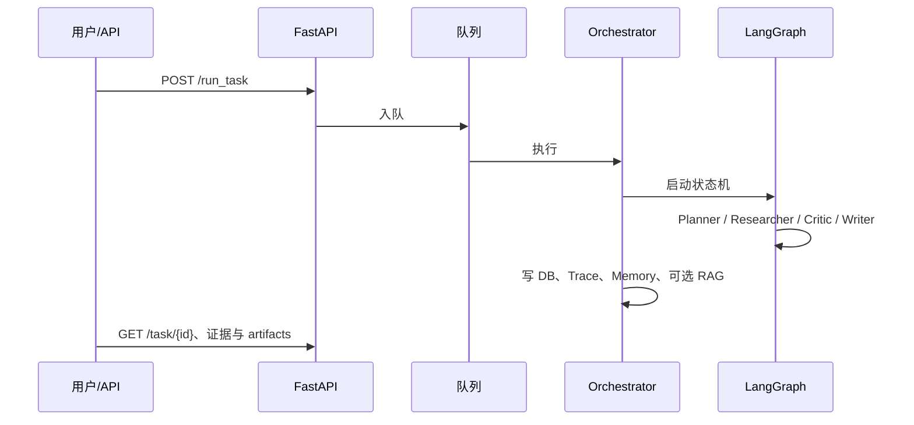

# 技术导读（练手项目向）

本文是面向「想快速理解实现细节、准备面试展示或开源阅读」的一页式导读，与 [`docs/gitbook/README.md`](gitbook/README.md) 中的章节手册互补：这里偏「从代码入口出发看什么」，手册偏「为什么这样设计」。

## 项目一句话

把开放式研究问题拆成多主题，并行 **搜索 + 抓取 → 证据卡片 → Critic 审查 → 带引用的中文报告**，并把 **LangGraph 编排、工具调用、RAG、记忆、模型路由、Trace/产物** 串成一条可观测链路。定位是 **Agent 工程练习平台**，不强调商业成熟度。

## 技术栈（务实版）

| 层次 | 选型 | 说明 |
| --- | --- | --- |
| API | FastAPI | REST、任务入队、RAG/证据/指标接口 |
| 编排 | LangGraph `StateGraph` | Planner → Researcher ↔ Critic → Writer 条件分支 |
| 持久化 | SQLite（默认） | 任务、步骤、日志、图状态等 |
| 队列 | 内存 / Redis 可切换 | 后台执行任务，避免长请求阻塞 |
| 向量库 | Chroma（可持久化目录） | RAG 知识入库与检索 |
| 搜索/抓取 | Tavily / SearXNG / Playwright / DuckDuckGo；抓取侧 Crawl4AI 优先 | 详见 [`README.md`](../README.md) 与 gitbook 工具章节 |
| 前端 | 静态 HTML/JS | 研究工作台与演示 |

配置加载顺序：**YAML（如 `config/dev.yaml`）→ `MATP_` 前缀环境变量覆盖**。密钥只放在本地 `.env`，仓库内仅有 [`.env.example`](../.env.example)。

## 请求生命周期（简化）

## 代码从哪里读起

| 想了解 | 建议入口 |
| --- | --- |
| 应用启动与路由挂载 | `app/main.py` |
| HTTP 路由与任务/RAG 接口 | `app/api/routes.py` |
| 研究主流程与 LangGraph | `app/services/orchestrator.py` |
| Planner / Researcher / Critic / Writer | `app/agents/*.py` |
| Web 搜索、抓取、沙盒等工具 | `app/tools/` |
| 任务状态与队列 | `app/services/task_manager.py`、`app/services/queue.py` |
| RAG 向量与入库 | `app/rag/` |
| 类型与领域模型 | `app/models/schemas.py` |

测试与评测：`tests/`、`evals/run_evals.py`。前端：`frontend/`。

## 与 GitBook 手册的对应关系

手册目录见 [`docs/gitbook/README.md`](gitbook/README.md)。若时间有限，可按下面顺序读：

1. [系统总览](gitbook/01-system-overview.md) — 边界与架构图  
2. [多 Agent 编排](gitbook/03-multi-agent-orchestration.md) — 状态机与协作  
3. [证据追踪](gitbook/09-evidence-tracing.md) — EvidenceCard、引用链  
4. [GitHub 展示建议](gitbook/12-github-showcase.md) — 上传与表述口径  

其余章节（工具调用、状态管理、RAG、记忆、模型路由、可观测性）在深入某一专题时再翻。

## 隐私与开源上传注意

- **永远不要提交** `.env`、含真实 API Key 的备份文件、本地数据库目录下的业务数据、运行产物中的敏感查询结果。  
- 仓库内应保留 **`.env.example`**（无真实密钥），并在 README 中说明「复制后本地填写」。  
- 推送前建议：`git status` 确认无 `.env` / `data/` 里误加的私密文件；必要时用 `git check-ignore -v <路径>` 验证忽略规则。

详见项目根目录 `.gitignore` 与 [`docs/gitbook/12-github-showcase.md`](gitbook/12-github-showcase.md)。

## 刻意不做 / 可后续加强（适合写在 README 或面试里）

- 生产级多租户鉴权、配额与审计  
- 搜索质量与反爬对抗的体系化评测  
- 更强的人机协同（HITL）与审批流  

把「已跑通的部分」和「诚实边界」写清楚，比夸大成熟度更可展示工程思维。
