# 从练手项目到 Agent 工程：迭代式深度研究平台完整讲解文档

这份文档用于对外讲解当前项目，并以此引申大模型 Agent 开发中的核心工程问题。它不是 README，也不是代码说明书，而是一份可以直接拿去串讲、录课或做技术分享的讲解稿。

项目主题是“迭代式深度研究智能体平台”。用户输入一个开放式研究问题后，系统会自动拆解研究主题，执行本地或自托管联网搜索，抓取网页正文，抽取段落级证据卡片，再由 Critic 判断证据是否充分，最后生成带引用索引的正式中文研究报告。

这套项目适合用来讲清楚几个关键问题：

- Agent 为什么不是一次 LLM 调用。
- LangGraph 如何把 Agent 流程变成可控状态机。
- Agent loop 如何落到代码中的 `plan -> act -> observe`。
- 工具调用如何接入联网搜索、网页抓取和 Markdown 渲染。
- 为什么需要证据卡片，而不是直接把搜索结果塞给 Writer。
- 上下文窗口、滚动摘要、长期记忆和 RAG 各自解决什么问题。
- 任务状态、日志、步骤、指标和产物如何持久化。
- 一个练手项目如何继续演进为更接近生产系统的 Agent 平台。

相关源码：

- 后端入口：[`app/main.py`](../app/main.py)
- API 路由：[`app/api/routes.py`](../app/api/routes.py)
- LangGraph 编排：[`app/services/orchestrator.py`](../app/services/orchestrator.py)
- Agent 实现：[`app/agents/`](../app/agents/)
- 工具实现：[`app/tools/`](../app/tools/)
- RAG 模块：[`app/rag/`](../app/rag/)
- 前端工作台：[`frontend/app.js`](../frontend/app.js)
- 图表资源：[`docs/assets/talk-diagrams/`](./assets/talk-diagrams/)

## 1. 项目定位

很多人第一次写 Agent，会从一个很简单的模式开始：用户提问，模型回答。如果再进一步，就让模型调用一个工具。这个模式适合 demo，但很难承担一类真实任务：开放式研究。

开放式研究有几个特点：

- 问题边界不清晰，需要先拆解。
- 信息可能不在模型参数中，需要联网搜索。
- 单个来源不可靠，需要多个来源交叉印证。
- 结论需要能回到来源，而不是只看起来像真的。
- 中间过程可能失败，需要跳过、重试或补充检索。
- 最终交付物不是聊天回答，而是一份可阅读的报告。

当前项目就是围绕这些问题构建的练手平台。它不追求复杂功能堆叠，而是把 Agent 工程的关键部件串起来：规划、检索、抓取、证据、审查、写作、持久化、RAG 和前端可视化。

可以用一句话介绍：

> 这是一个把开放式问题转化为可追溯研究报告的多智能体系统。

更工程化地说：

> 它是一个由 FastAPI、LangGraph、多个专职 Agent、MCP 风格工具、本地搜索链路、Crawl4AI 抓取、SQLite 状态存储和 RAG 缓存组成的深度研究工作台。

## 2. 系统总览

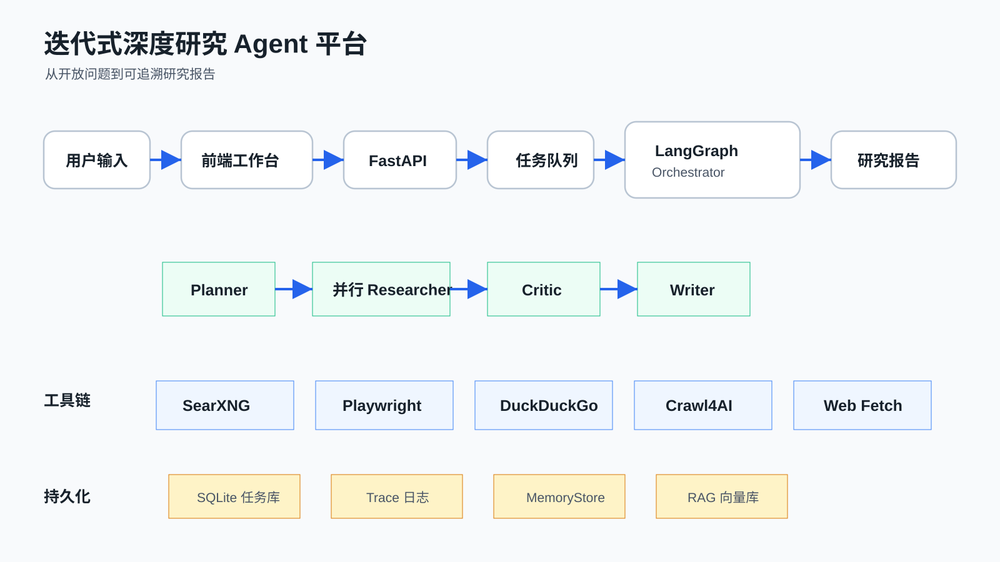

系统可以分为五层：

| 层级 | 组件 | 作用 |
| --- | --- | --- |
| 交互层 | 前端研究工作台 | 提交研究任务、查看报告、证据卡片、日志和历史任务 |
| API 层 | FastAPI | 提供任务创建、状态查询、证据查询、产物导出、删除和分页 |
| 编排层 | LangGraph Orchestrator | 管理 Planner、Researcher、Critic、Writer 的执行流 |
| 能力层 | Agents + Tools | 调用 LLM、搜索、抓取、整理证据和生成报告 |
| 存储层 | SQLite、MemoryStore、RAG | 保存任务状态、步骤、日志、记忆和可复用证据 |

这张图可以用来开场，重点强调：Agent 系统不是单个模型，而是一套围绕模型构建的任务执行系统。模型只是其中的推理和生成能力，真正让系统可用的是编排、工具、状态、记忆和可观测性。

## 3. 端到端任务生命周期

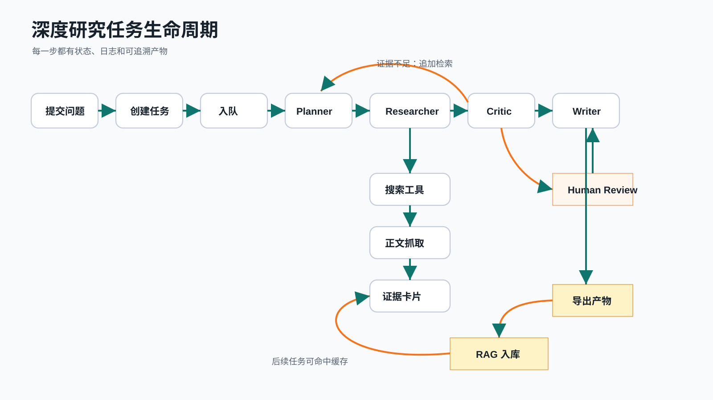

一个研究任务的生命周期如下：

1. 用户在前端输入研究问题。
2. `/run_task` 创建任务，写入 SQLite，并将任务放入队列。
3. `TaskQueue` 调用 `Orchestrator.execute_task()`。
4. LangGraph 从 `plan` 节点开始执行。
5. Planner 将问题拆解为 3 到 5 个研究主题。
6. Researcher 并行处理每个主题，执行搜索、抓取和证据卡片生成。
7. Critic 评估证据覆盖度、忠实度和相关性。
8. 如果证据不足，LangGraph 回到 `research` 节点追加检索。
9. 如果达到轮次上限或质量较低，可以进入 human review 节点。
10. Writer 基于证据卡片生成最终报告。
11. 任务状态、步骤、日志、工具调用和模型调用被持久化。
12. 证据卡片异步进入 RAG 知识库，供后续任务复用。

关键代码：

- `run_task()`：[`app/api/routes.py`](../app/api/routes.py)
- `execute_task()`：[`app/services/orchestrator.py`](../app/services/orchestrator.py)
- `TaskManager`：[`app/services/task_manager.py`](../app/services/task_manager.py)

讲解时可以强调一个点：这个生命周期里有两类循环。第一类是 Critic 驱动的研究循环，证据不足就继续检索。第二类是 RAG 驱动的知识复用循环，任务完成后进入知识库，下一次相似问题可以命中缓存。

## 4. Agent 的基本抽象：Plan -> Act -> Observe

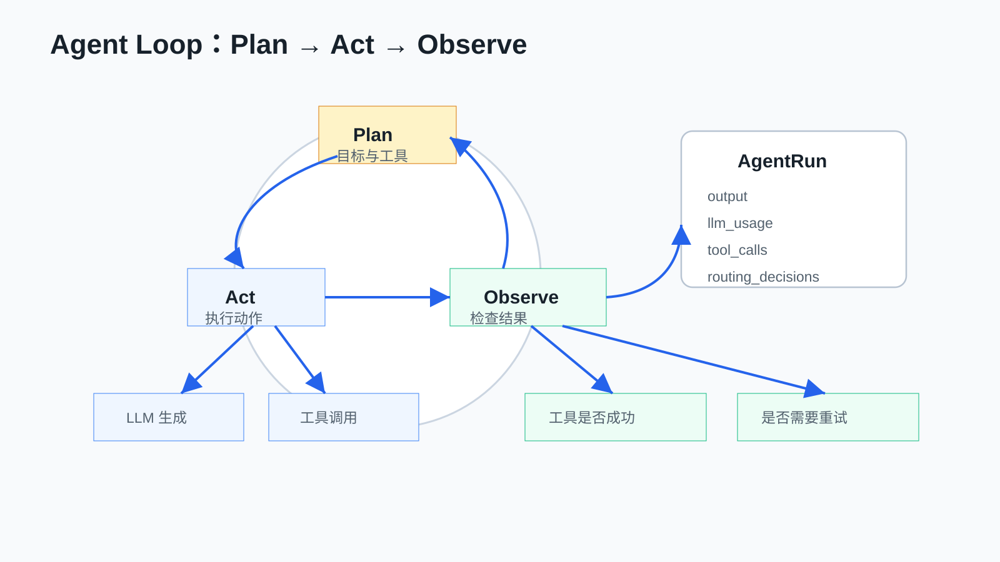

项目中的所有 Agent 都继承自 `BaseAgent`。它提供了统一的执行模板：

```python
async def run(self, task: str, context: dict[str, Any]) -> AgentRun:
    plan = await self.plan(task, context)
    action = await self.act(task, context, plan)
    observation = await self.observe(task, context, action)
    action.output.metadata.update({"observation": observation, "plan": plan})
    return action
```

这个 loop 分成三步：

| 阶段 | 含义 | 在项目中的表现 |
| --- | --- | --- |
| Plan | 明确目标、工具和成功标准 | Planner 拆题，Researcher 选择搜索 query |
| Act | 执行 LLM 生成或工具调用 | Search、Fetch、Critic 评估、Writer 写作 |
| Observe | 检查执行结果 | 工具是否成功、输出是否为空、是否需要记录 |

`AgentRun` 是统一输出结构，它包含：

- `output`：Agent 的结构化输出。
- `llm_usage`：模型调用、token、延迟和成本。
- `tool_calls`：工具调用结果。
- `routing_decisions`：模型路由选择。
- `metadata`：额外信息，例如证据卡片或评分。

关键代码：

- `BaseAgent`：[`app/agents/base_agent.py`](../app/agents/base_agent.py)
- `AgentRun`：[`app/agents/base_agent.py`](../app/agents/base_agent.py)

这部分可以引申一个更通用的 Agent 开发原则：Agent 不是一个 prompt，而是一个有生命周期、有输入输出协议、有工具边界、有失败观察能力的执行单元。

## 5. LangGraph：把 Agent 流程变成状态机

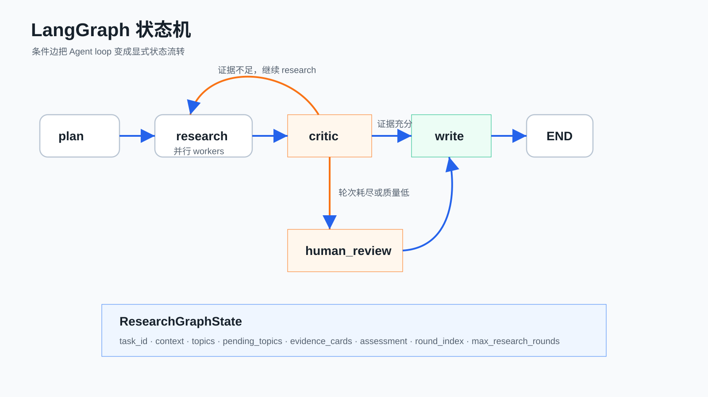

项目的核心编排逻辑在 `Orchestrator._build_graph()` 中。它用 LangGraph 的 `StateGraph` 表达外层状态机：

```text
plan -> research -> critic -> write -> END
                  \-> research
                  \-> human_review -> write
```

这比普通的链式调用更适合 Agent 系统，因为 Agent 系统的下一步经常取决于状态，而不是固定顺序。

当前图中有几个关键节点：

| 节点 | 作用 |
| --- | --- |
| `plan` | 生成研究主题和任务图 |
| `research` | 并行执行 Researcher，收集证据卡片 |
| `critic` | 判断证据是否足够 |
| `human_review` | 质量不足或轮次耗尽时触发人工审核 |
| `write` | 生成最终研究报告 |

关键状态对象是 `ResearchGraphState`，里面保存：

- `task_id`
- `context`
- `topics`
- `pending_topics`
- `evidence_cards`
- `assessment`
- `round_index`
- `max_research_rounds`
- `routing_decisions`

关键代码：

- `_build_graph()`：[`app/services/orchestrator.py`](../app/services/orchestrator.py)
- `_route_after_critic()`：[`app/services/orchestrator.py`](../app/services/orchestrator.py)

可以把这部分引申到 LangGraph 的核心价值：它不是让流程更花哨，而是让 Agent 的状态转移变得显式、可恢复、可观察、可测试。

## 6. Planner：把开放问题拆成可检索主题

Planner 的职责是把一个大问题拆成多个研究主题。默认模板包括：

- `scope`：澄清概念、定义和边界。
- `evidence`：寻找经验证据、案例和可衡量信号。
- `tradeoffs`：识别约束、不同观点和失败模式。
- `implementation`：梳理实践路径和工程细节。
- `outlook`：评估影响、开放问题和趋势。

这一步解决的是覆盖问题。开放式问题如果直接交给一个模型回答，容易遗漏关键角度。拆题之后，系统就能按主题检查证据是否充分。

关键代码：

- `PlannerAgent.build_research_topics()`：[`app/agents/planner.py`](../app/agents/planner.py)
- `PlannerAgent.build_task_graph()`：[`app/agents/planner.py`](../app/agents/planner.py)

这部分可以引申到更大的 Agent 设计问题：复杂任务通常需要先变成一个结构化任务图。规划不是为了显得智能，而是为了让后续执行可以被检查。

## 7. 并行 Researcher：让覆盖度变成工程事实

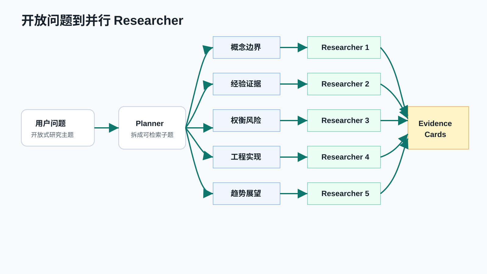

Planner 生成的多个 `ResearchTopic` 会被传给 Researcher 并行执行。实现上，`_run_research_parallel()` 使用 `asyncio.gather()` 同时运行多个研究主题。

并行 Researcher 的意义有两个：

- 降低整体耗时。
- 让不同研究角度独立产出证据，避免单一路径主导最终报告。

每个 Researcher 做的事情是：

1. 根据 topic 生成搜索 query。
2. 调用 `web_search` 找候选来源。
3. 调用 `web_fetch` 抓取正文。
4. 清洗 Cookie、导航、登录等噪音。
5. 把页面内容转成证据卡片。
6. 返回 topic summary 和 evidence cards。

关键代码：

- `_run_research_parallel()`：[`app/services/orchestrator.py`](../app/services/orchestrator.py)
- `ResearchAgent.act()`：[`app/agents/researcher.py`](../app/agents/researcher.py)

工程上需要特别注意：单个网页抓取失败不能打断整个研究主题。当前实现会跳过失败来源，继续处理下一条结果。这是联网 Agent 的基本容错能力。

## 8. 工具调用：搜索、抓取和输出检查

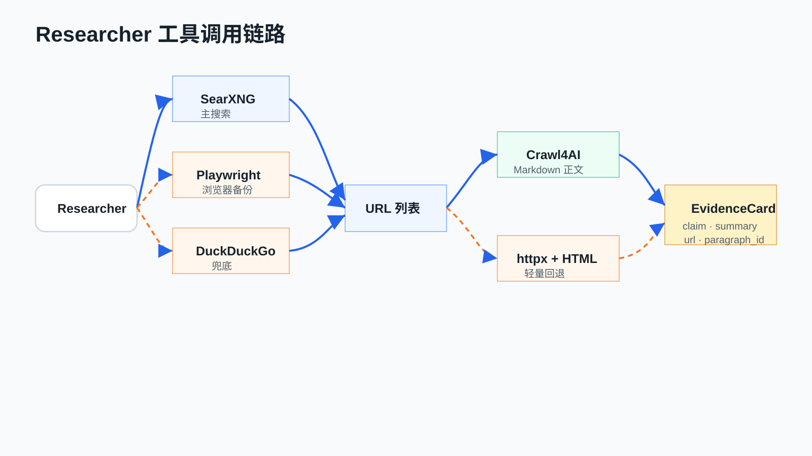

这个项目的工具是 MCP 风格的工具对象。每个工具有：

- `name`
- `description`
- `input_schema`
- `run()`

主要工具包括：

| 工具 | 作用 |
| --- | --- |
| `web_search` | 搜索网页并返回 URL、标题、snippet |
| `web_fetch` | 抓取网页正文并切成段落 |
| `doc_reader` | 读取本地文档 |
| `markdown_render` | 检查最终 Markdown |

### 搜索链路

当前推荐搜索链路是：

```text
SearXNG -> Playwright -> DuckDuckGo
```

设计原因：

- `SearXNG` 适合自托管，成本低，可控性强。
- `Playwright` 适合作为浏览器环境备份。
- `DuckDuckGo` 作为最后兜底。

项目已经废弃旧的 Chrome CDP 模式。CDP 直连对本地端口依赖强，失败模式多，不适合作为主要搜索基础设施。

关键代码：

- `WebSearchTool._provider_chain()`：[`app/tools/web_search.py`](../app/tools/web_search.py)
- `WebSearchTool._search_searxng()`：[`app/tools/web_search.py`](../app/tools/web_search.py)
- `WebSearchTool._search_playwright()`：[`app/tools/web_search.py`](../app/tools/web_search.py)

### 抓取链路

抓取侧优先使用 Crawl4AI：

```text
Crawl4AI -> Markdown 清洗 -> 段落切分 -> EvidenceCard
```

如果 Crawl4AI 不可用或抓取失败，系统会退回到 `httpx + HTML` 解析。

关键代码：

- `WebFetchTool._fetch_with_crawl4ai()`：[`app/tools/web_fetch.py`](../app/tools/web_fetch.py)
- `WebFetchTool._paragraphs_from_text()`：[`app/tools/web_fetch.py`](../app/tools/web_fetch.py)

这部分可以引申到工具调用的生产经验：工具调用的难点不在于函数能不能被模型调用，而在于工具结果是否稳定、可解析、可追踪，以及失败时系统如何继续前进。

## 9. 证据卡片：网页内容和最终报告之间的中间层

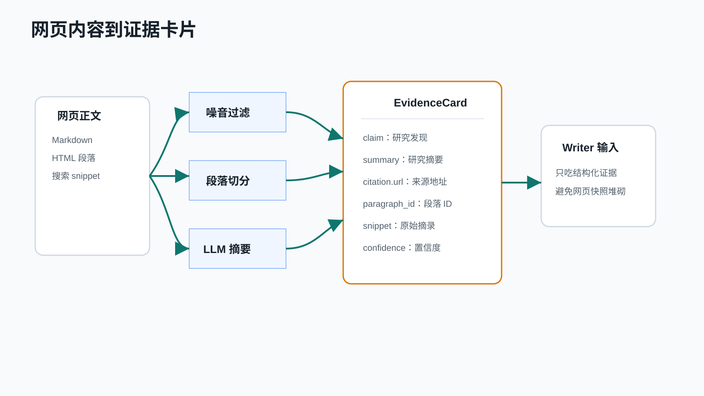

项目没有让 Writer 直接读取原始网页正文，而是先构建 `EvidenceCard`。每张证据卡包含：

| 字段 | 含义 |
| --- | --- |
| `card_id` | 由 topic、URL、段落 ID 生成的稳定 ID |
| `topic_id` | 所属研究主题 |
| `claim` | 这条证据支持的研究发现 |
| `summary` | 面向研究主题的摘要 |
| `citation.url` | 来源 URL |
| `citation.title` | 页面标题 |
| `citation.paragraph_id` | 段落编号 |
| `citation.snippet` | 原始摘录 |
| `confidence` | 来源分数或置信度 |
| `source_type` | web、knowledge_base、user 等 |

这是整个系统从“网页快照”走向“研究报告”的关键。

如果没有证据卡片，系统容易出现两个问题：

- 前端卡片只显示标题和链接，没有研究价值。
- Writer 直接堆叠搜索结果，报告读起来像中间材料。

现在的结构是：

```text
网页正文 -> 来源摘录 -> LLM 研究化摘要 -> EvidenceCard -> Writer 综合写作
```

关键代码：

- `EvidenceCard`：[`app/models/schemas.py`](../app/models/schemas.py)
- `ResearchAgent._draft_cards_with_llm()`：[`app/agents/researcher.py`](../app/agents/researcher.py)
- `ResearchAgent._build_preliminary_cards()`：[`app/agents/researcher.py`](../app/agents/researcher.py)

这部分可以引申到一个通用原则：Agent 的中间产物应该结构化。结构化之后，系统才能评估、过滤、复用和可视化。

## 10. Critic：从生成系统变成可审查系统

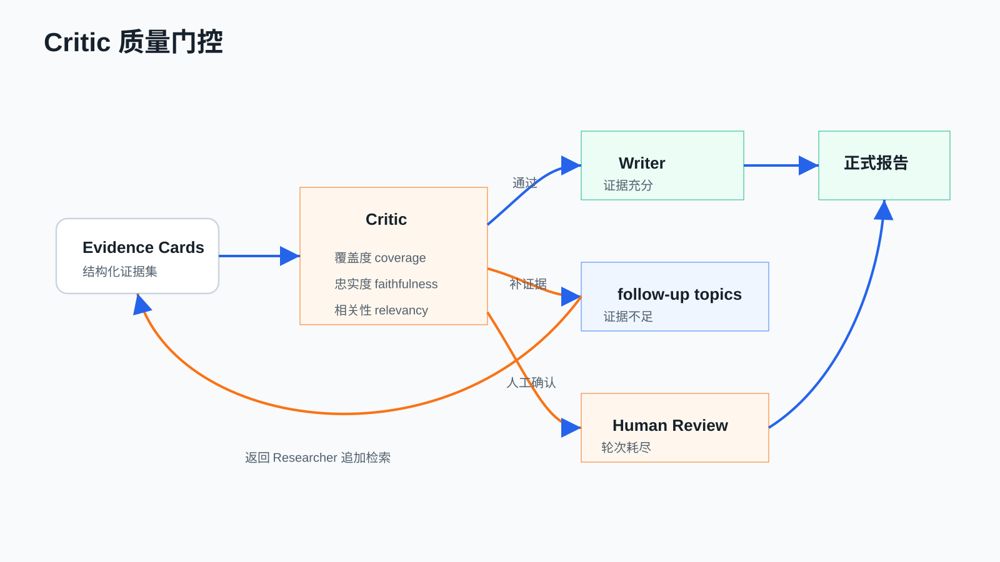

Critic 的职责不是润色，而是质量门控。它检查：

- 每个研究主题是否都有足够证据。
- 引用是否包含 URL 和段落 ID。
- 结论是否和任务相关。
- 是否需要生成 follow-up topics。

项目中 Critic 同时使用程序化评分和 LLM 审查意见。程序化评分包括：

- `coverage_score`
- `faithfulness_score`
- `answer_relevancy_score`

如果证据不足，Critic 会生成新的 `follow_up_topics`，LangGraph 会回到 `research` 节点继续检索。

关键代码：

- `CriticAgent._assess()`：[`app/agents/critic.py`](../app/agents/critic.py)
- `_route_after_critic()`：[`app/services/orchestrator.py`](../app/services/orchestrator.py)

可以引申到更一般的 Agent 工程经验：质量控制不应该只靠模型“自我反思”。更可靠的方式是模型输出结构化结果，系统用规则、阈值和状态机决定下一步。

## 11. Writer：从证据卡片生成正式研究报告

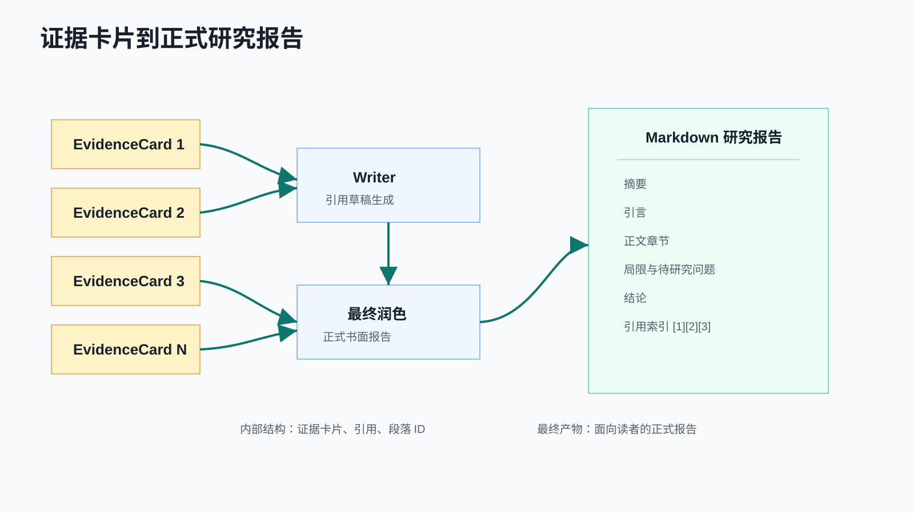

Writer 的目标是输出最终读者能直接阅读的正式报告，而不是把 topic、card、critic 分数等中间结构堆出来。

当前报告结构是：

```text
# 研究报告：<任务>
## 摘要
## 引言
## 正文
### 语义化章节
## 局限与待研究问题
## 结论
## 引用索引
```

Writer 的实现分两步：

1. 程序先根据证据卡片生成带引用的草稿。
2. LLM 再把草稿改写成正式报告。

系统会过滤一些不适合出现在最终报告里的中间痕迹，例如：

- `topic-1-scope`
- `Critic 给出的`
- `写作审查`
- Cookie、导航、登录提示等抓取噪音

关键代码：

- `WritingAgent._compose_report()`：[`app/agents/writer.py`](../app/agents/writer.py)
- `WritingAgent._sanitize_final_report()`：[`app/agents/writer.py`](../app/agents/writer.py)

这里可以强调“最终产物和中间表示分离”。Agent 平台内部需要结构化状态，但用户最终需要的是一份可读、连贯、有引用的报告。

## 12. 上下文管理：窗口、摘要和长期记忆

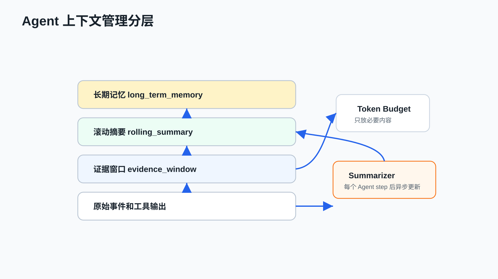

Agent 系统会很快遇到上下文膨胀问题。这个项目用了三层策略：

| 策略 | 作用 | 实现 |
| --- | --- | --- |
| 证据窗口 | Prompt 中只保留最近 N 张证据卡片 | `Orchestrator._evidence_window()` |
| 滚动摘要 | 每个 Agent 步骤结束后异步更新任务摘要 | `IncrementalSummarizer` |
| 长期记忆 | 把任务摘要持久化到 JSON | `MemoryStore.remember()` |

上下文管理的核心不是“塞更多 token”，而是分层保留信息：

- 当前推理需要的内容进入 prompt。
- 早期过程压缩为滚动摘要。
- 任务完成后的摘要进入长期记忆。
- 可复用证据进入 RAG 向量库。

关键代码：

- `MemoryStore`：[`app/services/memory.py`](../app/services/memory.py)
- `IncrementalSummarizer`：[`app/context/summarizer.py`](../app/context/summarizer.py)
- `ContextWindowManager`：[`app/context/window_manager.py`](../app/context/window_manager.py)

可以从这里引申到“上下文工程”。上下文工程不是单纯 prompt engineering，它包括信息选择、压缩、排序、过期、召回和持久化。

## 13. RAG：从问答增强到 Agent 记忆缓存

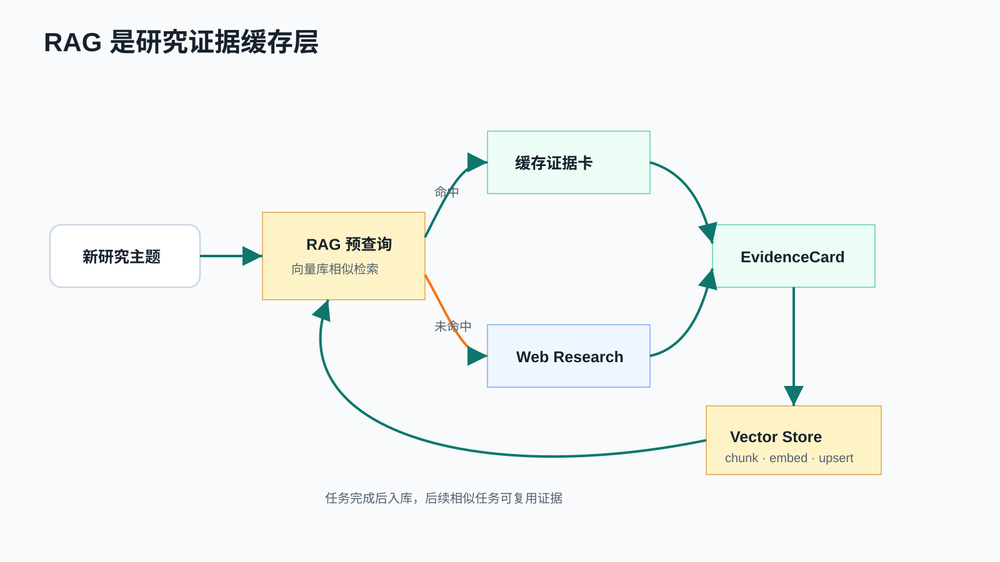

这个项目里的 RAG 不是直接回答问题，而是作为研究流程中的缓存层。

它在两个时机工作：

1. 研究开始前，Orchestrator 用 topic question 查询向量库。
2. 如果命中足够高质量的缓存，就把结果转成 `knowledge_base` 类型的 EvidenceCard，跳过网络搜索。
3. 任务完成后，证据卡片会异步分块、嵌入并写入向量库。

这种设计展示了 RAG 的另一种用法：它不是只用来“把文档塞给模型回答”，也可以成为 Agent 系统的长期知识缓存。

关键代码：

- `_split_topics_by_cache()`：[`app/services/orchestrator.py`](../app/services/orchestrator.py)
- `_ingest_to_rag()`：[`app/services/orchestrator.py`](../app/services/orchestrator.py)
- `AutoIngester`：[`app/rag/auto_ingester.py`](../app/rag/auto_ingester.py)
- `VectorStore`：[`app/rag/vector_store.py`](../app/rag/vector_store.py)

可以引申到 RAG 的几个工程问题：

- chunking 决定召回粒度。
- embedding 决定语义匹配质量。
- metadata 决定引用和过滤能力。
- min score 决定缓存命中是否可信。
- 去重和过期策略决定长期知识库是否会污染。

## 14. 持久化和可观测性

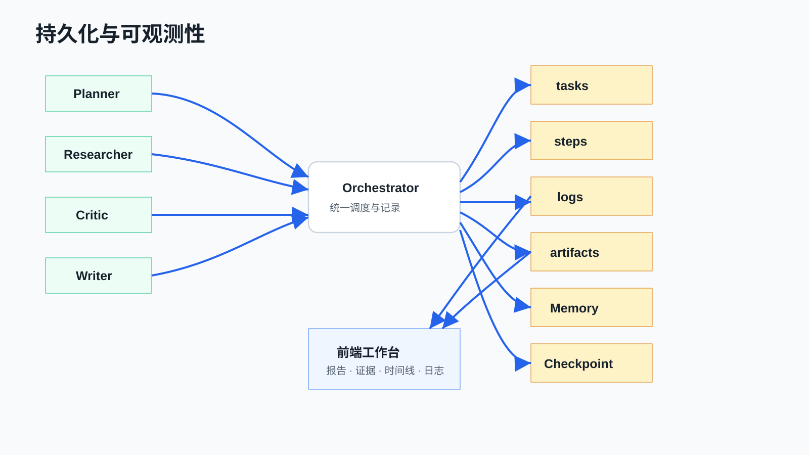

Agent 系统最怕黑箱。这个项目把多个层面的状态都保存下来：

| 数据 | 存储位置 | 作用 |
| --- | --- | --- |
| `TaskState` | SQLite `tasks` | 查询任务状态和最终报告 |
| `StepState` | SQLite `steps` | 查看每个 Agent 步骤 |
| `LogEntry` | SQLite `logs` | trace 和错误定位 |
| LangGraph checkpoint | SQLite checkpoint DB | 支持中断和 human review 恢复 |
| long term memory | JSON | 保存滚动摘要和任务摘要 |
| artifacts | `artifacts/runs/` | 导出报告、证据、引用、trace、metrics |

前端展示：

- 研究报告
- 证据卡片
- Critic 评分
- Agent 时间线
- 日志
- 最近研究分页
- 批量删除

关键代码：

- `TaskManager`：[`app/services/task_manager.py`](../app/services/task_manager.py)
- `ResearchArtifactExporter`：[`app/services/artifacts.py`](../app/services/artifacts.py)
- 前端工作台：[`frontend/app.js`](../frontend/app.js)

可以引申到生产 Agent 系统的可观测性：除了普通服务日志，还需要记录每个 Agent 节点、模型路由、prompt token、工具调用、重试、错误分类和最终产物。

## 15. 前端工作台：把 Agent 过程展示给人

前端不是算法核心，但它对讲解和调试很重要。

当前工作台提供：

- 新建研究任务。
- 查看最近研究，支持分页、批量选择和删除。
- 查看最终报告。
- 查看证据卡片。
- 查看 Critic 评分。
- 查看 Agent 执行时间线。
- 查看日志。
- 从报告中选中文本生成用户卡片。
- 导出 JSON 或 Markdown。

这部分可以作为现场演示主线。推荐演示题目：

```text
智能体记忆系统的主流架构、长期记忆评测方法与工程风险
```

演示顺序：

1. 提交研究问题。
2. 展示 Planner 拆分出的主题。
3. 展示 Researcher 并行搜索和证据卡片。
4. 展示 Critic 评分和是否补充检索。
5. 打开最终报告。
6. 解释引用索引如何映射回证据卡片。
7. 展示任务时间线和日志。
8. 展示最近研究分页和批量删除。

这个演示能让听众看到：Agent 应用不是一个回答框，而是一套可观察、可追踪、可维护的执行系统。

## 16. 从当前项目引申到更大的技术体系

当前项目是练手项目，但它几乎覆盖了 Agent 工程的主干。下面可以从它引申到更大的技术体系。

### 16.1 LangGraph 和工作流编排

当前项目用 LangGraph 管理 `plan -> research -> critic -> write`。更复杂的系统可以继续扩展：

- 多个 Planner，根据任务类型选择不同规划器。
- 动态 Send API，把子任务分发给多个 worker。
- 节点级 checkpoint，支持暂停、恢复和人工审核。
- 子图，把搜索、分析、写作拆成独立 graph。
- 更复杂的条件边，例如按成本、风险、来源质量路由。

要讲清楚的一点是：LangGraph 的价值在于显式状态，不在于把简单链路包得更复杂。

### 16.2 MCP 和工具生态

当前工具是 MCP 风格，但还不是完整 MCP server。可以引申到 MCP：

- 工具 schema 标准化。
- LLM 客户端可以动态发现工具。
- 搜索、数据库、浏览器、文件系统都可以成为外部工具。
- 工具权限、鉴权和审计会变得更重要。

当前项目里的 `web_search`、`web_fetch`、`doc_reader`、`markdown_render` 都可以被抽象成 MCP 工具。

### 16.3 搜索基础设施

项目选择 SearXNG 作为主搜索源，是因为付费搜索 API 成本可能高于模型调用本身。

可以引申到几类方案：

- Tavily、SerpAPI 等商业搜索 API：接入简单但成本高。
- SearXNG 自托管：成本低，可控，但需要维护。
- Playwright 浏览器搜索：适合备份，不适合作为主链路。
- MCP 搜索 server：适合把搜索能力暴露给多个 Agent 客户端。
- 企业内部搜索：接入内部文档、Wiki、知识库和数据库。

这里的核心观点是：搜索不是一个工具函数，而是一层基础设施。

### 16.4 Crawl4AI 和网页理解

抓网页不等于拿 HTML。真正有用的是把网页转成可读正文，并去掉模板噪音。

可以引申到：

- HTML 清洗。
- Markdown 抽取。
- JS 渲染页面。
- 登录墙和反爬处理。
- PDF 和多模态文档抓取。
- 来源质量评分。

当前项目使用 Crawl4AI 作为主抓取层，`httpx + HTML` 作为轻量回退。

### 16.5 RAG 和长期记忆

当前 RAG 是缓存层。更大的系统可以演进为：

- 项目级知识库。
- 用户级长期记忆。
- 团队级研究资料库。
- 跨任务证据复用。
- 事实图谱或实体关系网络。
- 自动过期和来源可信度衰减。

需要提醒的是：RAG 不是“把所有东西都存起来”。RAG 的质量取决于写入策略、切块策略、metadata、召回阈值和清理策略。

### 16.6 上下文工程

当前项目已经有证据窗口、滚动摘要和长期记忆。可以继续引申到：

- prompt cache
- context ranking
- lost-in-the-middle 缓解
- 多轮压缩
- 任务级 scratchpad
- 证据优先级排序
- 冲突证据保留

上下文工程的目标是让模型看到“当前最该看的内容”，而不是最多内容。

### 16.7 评测和回归

当前项目有测试和离线评测脚本。生产级 Agent 还需要：

- 固定问题集。
- 来源数量和引用质量指标。
- 覆盖度、忠实度和相关性评分。
- 工具失败率。
- 抓取成功率。
- 平均成本和延迟。
- 报告质量人工评审。

Agent 系统迭代时最容易出现的问题是“看起来更聪明，实际上更不稳定”。评测的作用是避免这种回退。

### 16.8 安全和沙箱

当前项目有 Python 执行工具和浏览器工具，这类能力会引入安全问题。可以引申到：

- 工具权限隔离。
- 文件系统沙箱。
- 网络访问白名单。
- 命令执行审计。
- prompt injection 防护。
- 来源内容不可信处理。
- 用户审批和 human-in-the-loop。

任何能读文件、写文件、访问网络或执行代码的 Agent，都应该被当成一个需要权限边界的执行体。

## 17. 和常见 Agent 技术栈的关系

| 技术 | 和本项目的关系 |
| --- | --- |
| LangGraph | 当前项目的状态机和循环编排核心 |
| LangChain | 可作为工具、文档加载、retriever 生态补充 |
| OpenAI Responses API | 可用于更统一的工具调用和多模态交互 |
| OpenAI Agents SDK | 可借鉴 tracing、handoff、tool lifecycle 等模式 |
| MCP | 可把搜索、抓取、数据库等工具标准化暴露 |
| SearXNG | 当前推荐的自托管搜索主链路 |
| Crawl4AI | 当前推荐的网页正文抽取层 |
| Playwright | 浏览器自动化备份能力 |
| ChromaDB | 当前向量存储方向之一 |
| Redis | 队列和分布式任务调度可选后端 |
| OpenTelemetry | 生产化 trace 和 observability 可扩展方向 |

这张表可以用来把练手项目和行业常见技术连接起来。讲解时不要把所有技术都讲深，而是说明它们分别处在哪一层。

## 18. 生产化还差什么

这个项目已经适合练习和展示，但离生产还有距离。

优先级较高的生产化方向：

1. 任务取消、暂停和重试控制。
2. 更可靠的队列，例如 Redis、Celery 或 Dramatiq。
3. 更严格的工具权限和沙箱。
4. 搜索结果重排和来源可信度评分。
5. RAG 去重、过期和质量评估。
6. 更完整的评测集和回归报告。
7. 多用户隔离和权限控制。
8. 成本预算和模型路由策略。
9. 更完善的 trace UI。
10. 对 PDF、Word、网页快照等来源类型的支持。

可以这样总结：

> 当前项目已经具备 Agent 系统的骨架。生产化要补的是可靠性、安全性、可观测性、权限和评测。

## 19. 对外讲解大纲

### 19.1 15 分钟版本

适合快速分享。

1. 为什么开放式研究不能只靠一次 LLM 调用。
2. 展示系统总览图。
3. 演示提交任务到生成报告。
4. 讲 Planner、Researcher、Critic、Writer 四个 Agent。
5. 讲证据卡片和引用追溯。
6. 总结 Agent 工程原则。

### 19.2 30 分钟版本

适合技术组分享。

1. 项目定位和问题背景。
2. LangGraph 状态机。
3. Agent loop。
4. 并行 Researcher。
5. 本地搜索和 Crawl4AI。
6. 证据卡片。
7. Critic 反馈闭环。
8. Writer 报告生成。
9. RAG 和上下文管理。
10. 现场演示。

### 19.3 60 分钟版本

适合系统讲解或课程。

1. Agent 和传统 LLM 应用的区别。
2. 项目架构拆解。
3. FastAPI、队列和任务状态。
4. LangGraph 状态机和 checkpoint。
5. BaseAgent loop。
6. Planner 拆题。
7. Researcher 工具调用。
8. 本地搜索基础设施。
9. Crawl4AI 和网页正文抽取。
10. EvidenceCard 结构设计。
11. Critic 质量门控。
12. Writer 正式报告生成。
13. 上下文窗口和滚动摘要。
14. RAG 缓存闭环。
15. 持久化、日志和前端可观测。
16. 生产化差距和扩展方向。

## 20. 现场演示脚本

演示前准备：

```bash
cd multi-agent-task-platform
source .venv/bin/activate
uvicorn app.main:app --reload
```

打开：

```text
http://127.0.0.1:8000
```

推荐演示问题：

```text
智能体记忆系统的主流架构、长期记忆评测方法与工程风险
```

讲解顺序：

1. 新建研究任务。
2. 说明任务进入队列和状态持久化。
3. 展示 Agent 时间线。
4. 展示证据卡片，解释 `claim / summary / snippet`。
5. 展示 Critic 评分。
6. 展示最终研究报告。
7. 展示引用索引。
8. 展示最近研究分页和批量删除。
9. 说明任务完成后证据进入 RAG。

可以现场打开的代码：

- `app/services/orchestrator.py`
- `app/agents/base_agent.py`
- `app/agents/researcher.py`
- `app/tools/web_search.py`
- `app/tools/web_fetch.py`
- `app/rag/auto_ingester.py`

## 21. 图表和 GPT-Image-2 生成

本文档已经插入 12 张本地 SVG 图，放在：

```text
docs/assets/talk-diagrams/
```

如果要用 GPT-Image-2 重新生成更适合幻灯片的图片，可以运行：

```bash
OPENAI_API_KEY=... .venv/bin/python scripts/generate_talk_images.py
```

脚本会生成 PNG，并自动把本文档中的图片引用从 `.svg` 切换到 `.png`。

可以只生成某一张：

```bash
OPENAI_API_KEY=... .venv/bin/python scripts/generate_talk_images.py --only 01-system-overview
```

脚本位置：

- [`scripts/generate_talk_images.py`](../scripts/generate_talk_images.py)

制图建议：

- 使用 16:9。
- 中文标签要短。
- 架构图尽量浅色背景。
- 控制流、数据流、存储层使用不同颜色。
- 不要要求透明背景。
- 不要让模型画太多小字。

## 22. 可以作为结尾的总结

这个项目最适合传达的观点是：

> Agent 开发不是把大模型放进一个循环里，而是围绕任务状态、工具能力、质量门控、上下文管理、记忆和可观测性构建一个可运行系统。

模型负责理解、总结和写作；系统负责拆解、调度、约束、持久化、回退和追溯。真正可用的 Agent 应用，来自这两部分的配合。

当前项目虽然是练手项目，但它已经覆盖了 Agent 应用的主干结构。继续往前走，可以接入更标准的 MCP 工具生态，更强的 RAG 记忆系统，更严格的沙箱和权限控制，以及更完整的评测和观测体系。

## 附录 A：关键文件索引

| 主题 | 文件 |
| --- | --- |
| 应用入口 | [`app/main.py`](../app/main.py) |
| API 路由 | [`app/api/routes.py`](../app/api/routes.py) |
| LangGraph 编排 | [`app/services/orchestrator.py`](../app/services/orchestrator.py) |
| 任务持久化 | [`app/services/task_manager.py`](../app/services/task_manager.py) |
| 队列 | [`app/services/queue.py`](../app/services/queue.py) |
| 长期记忆 | [`app/services/memory.py`](../app/services/memory.py) |
| Agent 基类 | [`app/agents/base_agent.py`](../app/agents/base_agent.py) |
| Planner | [`app/agents/planner.py`](../app/agents/planner.py) |
| Researcher | [`app/agents/researcher.py`](../app/agents/researcher.py) |
| Critic | [`app/agents/critic.py`](../app/agents/critic.py) |
| Writer | [`app/agents/writer.py`](../app/agents/writer.py) |
| 搜索工具 | [`app/tools/web_search.py`](../app/tools/web_search.py) |
| 抓取工具 | [`app/tools/web_fetch.py`](../app/tools/web_fetch.py) |
| RAG 入库 | [`app/rag/auto_ingester.py`](../app/rag/auto_ingester.py) |
| 向量库 | [`app/rag/vector_store.py`](../app/rag/vector_store.py) |
| 前端 | [`frontend/app.js`](../frontend/app.js) |

## 附录 B：常见提问和回答

### 为什么不用一个大 prompt 直接生成报告？

因为开放式研究需要可追溯来源、覆盖检查和失败恢复。一个大 prompt 也许能生成流畅文本，但很难证明每个结论来自哪里，也难以定位哪一步失败。

### 为什么要有 EvidenceCard？

EvidenceCard 是网页内容和最终报告之间的中间结构。它把来源、段落、摘要、claim 和置信度统一起来，方便 Critic 评估，也方便 Writer 引用。

### 为什么 SearXNG 放在主搜索链路？

因为搜索 API 成本可能很高，自托管搜索更适合练手项目和长期实验。Playwright 和 DuckDuckGo 作为备份可以提高可用性。

### RAG 在这里为什么不是主回答器？

因为这个项目的目标是研究流程，不是单轮知识库问答。RAG 在这里承担缓存和复用作用，命中时减少重复搜索，未命中时继续走 Web Research。

### Critic 会不会只是形式？

如果 Critic 只输出一段评论，那确实容易变成形式。当前项目让 Critic 的评分影响 LangGraph 路由，因此它会实际决定是否追加检索或进入写作。

### 这个项目最值得继续增强什么？

优先增强搜索结果重排、来源可信度评分、RAG 去重过期、任务取消、工具沙箱和评测体系。这些比继续堆更多 Agent 更有工程价值。
