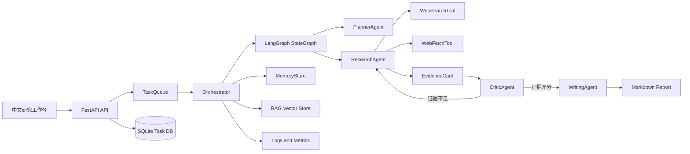

# 1. 系统总览

本项目是一个面向开放式问题的多智能体深度研究练习平台。它不是把用户问题直接丢给一个大模型生成答案，而是把研究过程拆成可追踪的工程步骤：规划、检索、证据抽取、证据审查、报告生成、产物导出。

## 核心问题

普通 LLM 问答在复杂研究任务里常见三个问题：

- 结论来源不清楚，难以确认每句话是否有证据支撑。
- 一次性生成容易遗漏关键角度，尤其是开放式问题。
- 工具调用、模型选择、失败重试和成本统计缺少工程闭环。

这个项目的设计目标是把这些问题拆开练习：Planner 负责拆解问题，Researcher 负责找证据，Critic 负责审查证据，Writer 负责基于证据写报告，Orchestrator 负责状态流转和失败处理。它更强调“把 Agent 工程能力串起来”，而不是声称每个模块都已经达到成熟生产标准。

## 总体架构

## 运行链路

一次任务的主链路如下：

1. 用户在前端或 API 提交任务。
2. `TaskManager` 创建 `TaskState`，记录任务 ID、Trace ID、状态和元数据。
3. `TaskQueue` 把任务交给后台执行，避免 API 请求长时间阻塞。
4. `Orchestrator` 启动 LangGraph 状态机。
5. `PlannerAgent` 生成研究主题和任务图。
6. `ResearchAgent` 对每个主题并行调用搜索和抓取工具。
7. 系统把来源正文转成 `EvidenceCard`。
8. `CriticAgent` 检查证据覆盖度、引用完整性和相关性。
9. 如果证据不足，Critic 生成 follow-up topics，流程回到 Research。
10. 如果证据足够，`WritingAgent` 生成带引用的 Markdown 报告。
11. 任务结果、步骤、工具调用、模型调用、日志和指标持久化。
12. 用户可通过 API 导出报告、证据卡片、引用、Trace 和 Metrics。

## 项目边界

这个项目更像“研究型 Agent 工程练习平台”，不是通用聊天机器人，也不是成熟生产系统。它的优势在于流程清晰、状态可见、证据可追踪，并且把多个 Agent 技术点组合到一条完整链路中；代价是任务类型更聚焦，主要适合研究报告、资料梳理、技术调研和方案比较。

从 GitHub 展示角度看，建议坦诚说明它是练手项目。重点讲清楚自己为什么这样拆模块、每个模块解决什么问题、哪些地方已经跑通、哪些地方未来还可以增强。这样的表述比直接包装成“企业级系统”更可信。

## 代码入口

- 应用入口：`app/main.py`
- API 路由：`app/api/routes.py`
- 编排核心：`app/services/orchestrator.py`
- Agent 基类：`app/agents/base_agent.py`
- 四类 Agent：`app/agents/planner.py`、`researcher.py`、`critic.py`、`writer.py`
- 数据模型：`app/models/schemas.py`
- 工具层：`app/tools/`
- RAG 层：`app/rag/`
- 记忆层：`app/services/memory.py`
